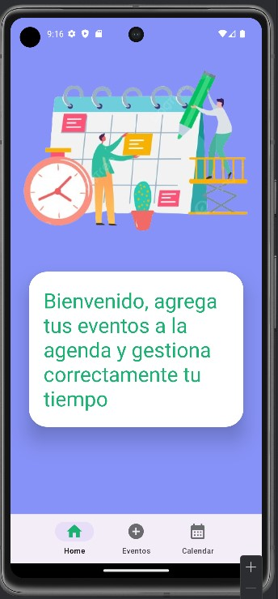
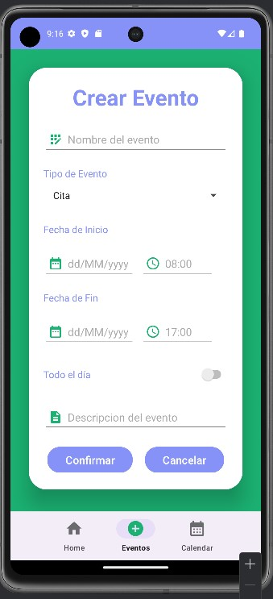
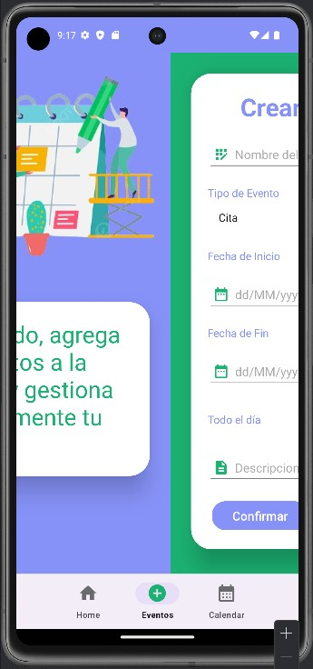
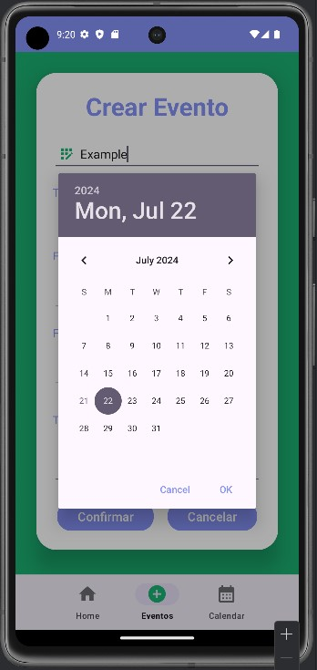
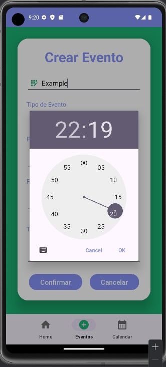
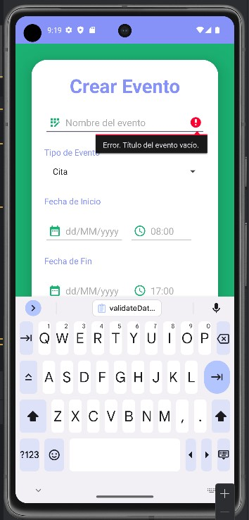
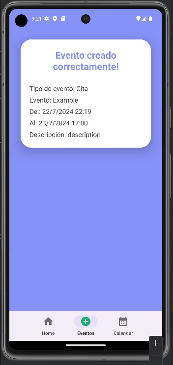

# Mobile application for adding new events to the calendar
## About me:
```bash
International University of La Rioja,Major in Software Engineering
```
## Project Description:
It consists of creating an agenda that allows new events to be added to the calendar. The scope of the solution will be limited only to the creation of the screens and the validation logic, later includes integration with phone calendar services or cloud accounts.

## Tech Stack Used:
```bash
BackEnd:
    * Java 
Database:
    * Postgres or Firebase come soon !
```
## Features of the app:
Requested function:
```bash
*Home Fragment with image and message
*BottomAppBar with BottomNavigationView 
*navigation between fragments loading in FragmentContainerView
*show DatePickerDialog
*Fragment for create a event with title, datetime start, datetime end, Spinner type of event, Switch for All day Event and description
*Validations for create a new even
```
## Some screenshots:
Home Fragment                       |                   Events Fragment      |   Animation Transition                 |      DateTimePicker
:---------------------------------: |      :------------------------------:  |   :------------------------------:     |      :------------------------------:
  |  |  |  

TimePicker                          |                   Validation Form      | Success Fragment Send data between fragments 
:---------------------------------: |      :------------------------------:  | :---------------------------------:          
  |        |   |

